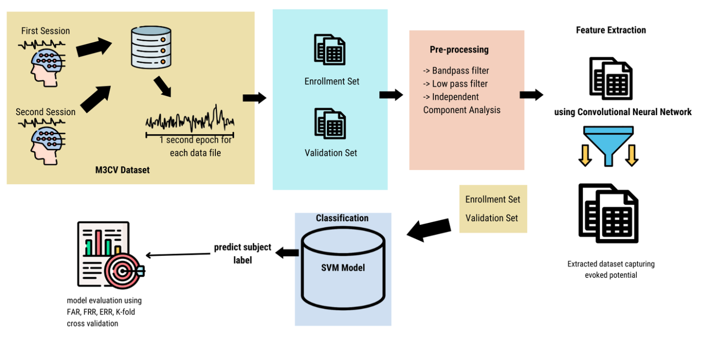
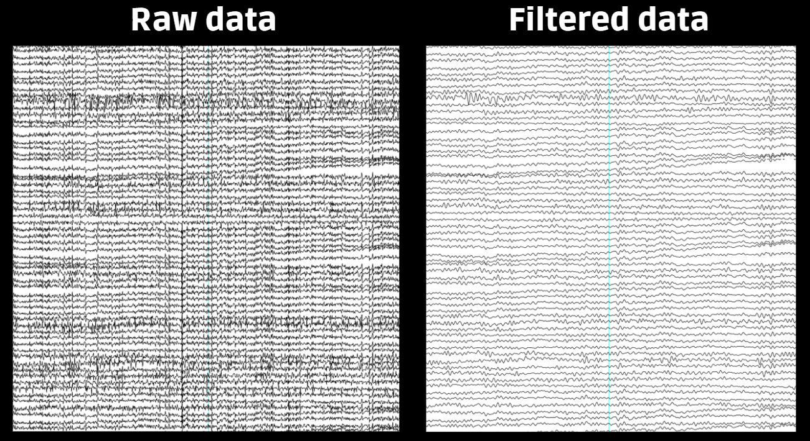
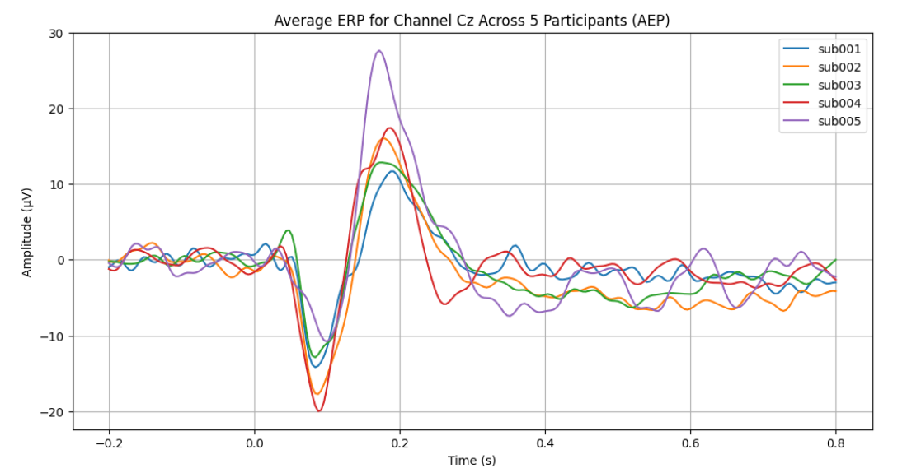

# Mindlock : Utilizing Convolutional Neural Network and Support Vector Machine ina Brainwave-based Authentication

## Overview
Mindlock introduces a novel brainwave-based authentication system utilizing Electroencephalography (EEG) signals. This research leverages the unique patterns in users' brain activity during sensory tasks (Visual, Auditory, and Somatosensory) for secure biometric authentication. By combining Convolutional Neural Networks (CNN) for feature extraction and Support Vector Machines (SVM) for classification, this project aims to offer a robust and reliable security mechanism.

*Image above shows the conceptual framework of the study*

## Purpose
The project addresses the need for more secure and dynamic authentication methods by developing a system that can:
- Identify unique brainwave patterns for user authentication
- Authenticate legitimate users and reject unauthorized intruders
- Evaluate the system's performance using metrics like False Acceptance Rate (FAR), False Rejection Rate (FRR), and Equal Error Rate (EER)

## Dataset
- **Source:** M3CV Dataset (Multi-subject, Multi-session, and Multi-task EEG Database) from [Kaggle](https://www.kaggle.com/competitions/eeg-biometric-competition/overview)
- **Data Organization:** Pandas was utilized to access dataset's csv to organize file to their respective folders

## Methodology
- **Preprocessing:** MNE-Python was utilized for data cleaning and extract unique user features

*Left shows raw eeg file, right shows filtered eeg file after MNE preprocessing*

- **Feature Engineering:** Mindlock takes advantage of subject's event-related potential or the reaction to a stimulus as a biometric factor

*Graph shows the different reaction of five users to an audio stimuli demonstrating their uniqueness to each other*

- **Feature Extraction:** CNN was utilized to extract unique brainwave patterns from subjects, focusing on event-related potential
2. **Classification:** The SVM classifier achieved an accuracy of 97.12%, with a FAR of 0.75% and FRR of 2.88% in Session 1. For Session 2, accuracy was 49.86%, highlighting inter-session variability.
3. **Hyperparameter Optimization:** Fine-tuned CNN architecture using Keras Tuner improved classification performance by automating hyperparameter selection.

- Note:Metrics indicate strong performance in controlled conditions but suggest the need for improved inter-session consistency.

## Development Environment
- **Languages/Frameworks:** Python, TensorFlow, Keras, MNE, Pandas, Numpy
- **Platform:** Google Colab, Google Drive for storage

For further details, refer to the full research paper included in this GitHub repository.

